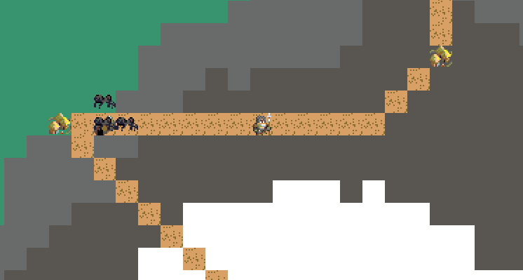

# bevy_roguelike_prototype
A rogue-like game built in bevy and rust.

### Screenshots:

### Credits:
- `Toen's Medieval Strategy Sprite Pack` - Created by Andre Mari Coppola (http://toen.itch.io/toens-medieval-strategy)

### Twitch Stream/Youtube playlist:
Twitch streams can be found here:
https:/www.twitch.tv/startoaster23

Past streams can be found here:
https://www.youtube.com/playlist?list=PL7baxgEDGgkScSjkbsODLOo_VKdu--9cw